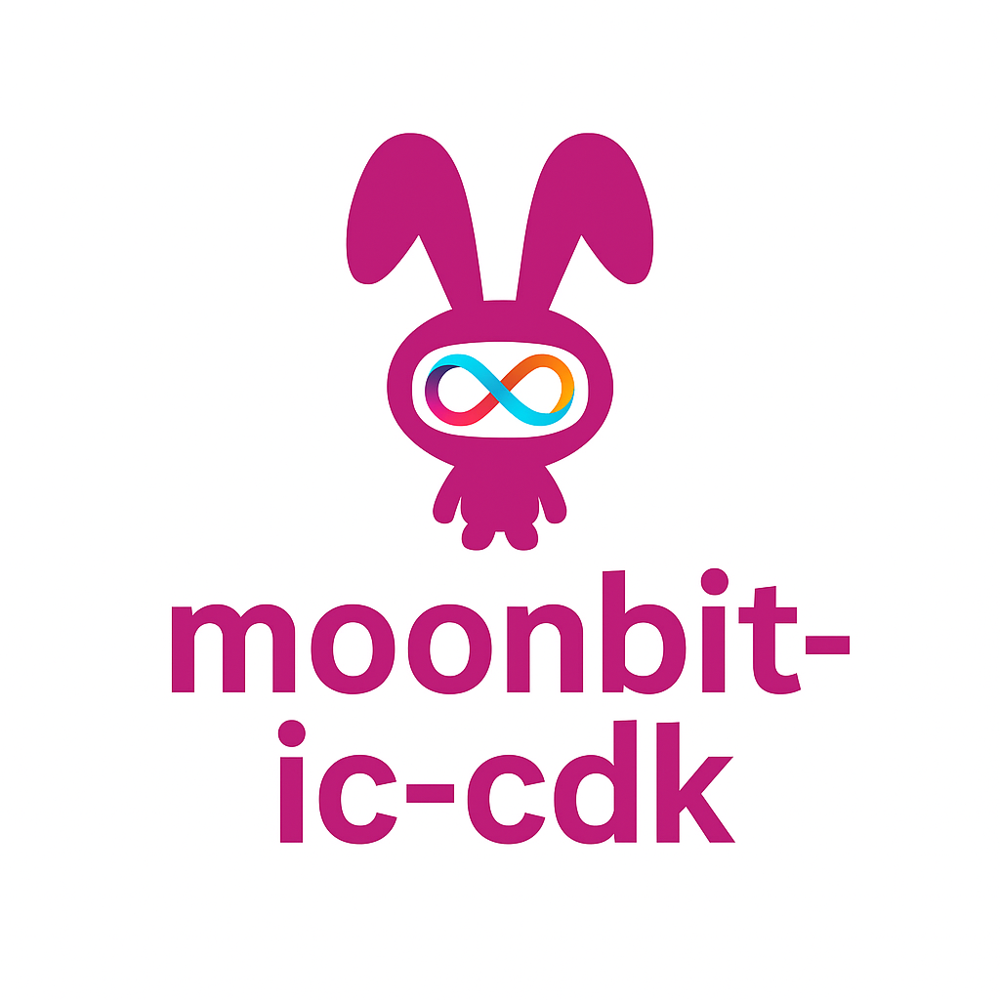

[](https://www.moonbitlang.com/)
[](https://github.com/dfinity/awesome-internet-computer)

<p align="center">
  
</p>

<h1 align="center">🌙 moonbit-ic-cdk</h1>

<p align="center">
  <strong>A lightweight, WebAssembly-native Canister Development Kit for building smart contracts on the Internet Computer with MoonBit.</strong>
</p>

<p align="center">
  <a href="#features">Features</a> •
  <a href="#quick-start">Quick Start</a> •
  <a href="#documentation">Documentation</a> •
  <a href="#examples">Examples</a> •
  <a href="#contributing">Contributing</a> •
  <a href="#license">License</a>
</p>

---

## 📖 Introduction

`moonbit-ic-cdk` is a MoonBit Canister Development Kit designed for the Internet Computer (ICP). It provides a complete set of API bindings and utilities that enable developers to build high-performance, compact smart contracts using the MoonBit language.

### Why MoonBit?

[MoonBit](https://www.moonbitlang.com/) is a programming language and toolchain optimized for WebAssembly (WASM), designed for modern cloud and edge computing. It compiles into compact, high-performance WASM binaries with exceptional compile-time and runtime efficiency.

**Advantages of MoonBit for ICP Canister Development:**

- 🚀 **High Performance** - Built for WebAssembly from the ground up, generating compact and efficient binaries
- 🎯 **Developer Friendly** - Easier to learn than Rust with clean and intuitive syntax
- ⚡ **Lightweight** - Low runtime overhead, perfect for resource-constrained smart contract environments
- 🔧 **Strong Compatibility** - Seamless integration with IC system APIs

---

## ✨ Features

### Core Capabilities

- ✅ **Complete IC System API Bindings**
  - Low-level `ic0` FFI bindings
  - High-level system API abstractions
  - Principal type and utility functions

- ✅ **Complete Candid Serialization/Deserialization**
  - Support for all Candid primitive types
  - LEB128 encoding/decoding support
  - Candid IDL builder
  - Type-safe encoders and decoders

- ✅ **HTTP Request/Response Handling**
  - HTTP service Canister support
  - Request/response type definitions
  - Compliant with IC HTTP Gateway interface specification

- ✅ **Storage and Memory Management**
  - Stable memory APIs
  - Storage utility functions
  - Low-level memory operations

### Project Status

- ✅ **Phase 1**: Core ICP types and system API support
- ✅ **Phase 2**: Candid serialization/deserialization and HTTP APIs
- 🚧 **Phase 3**: Management Canister API, inter-canister calls, JSON serialization, etc. (In Progress)

---

## 🚀 Quick Start

### Prerequisites

- [MoonBit](https://www.moonbitlang.com/) compiler
- [DFX](https://internetcomputer.org/docs/current/developer-docs/setup/install/) (Internet Computer development toolkit)

### Install MoonBit

**Linux & macOS:**
```bash
curl -fsSL https://cli.moonbitlang.com/install/unix.sh | bash
```

**Windows (PowerShell):**
```powershell
Set-ExecutionPolicy RemoteSigned -Scope CurrentUser
irm https://cli.moonbitlang.com/install/powershell.ps1 | iex
```

### Clone the Repository

```bash
git clone https://github.com/eliezhao/moonbit-ic-cdk.git
cd moonbit-ic-cdk
```

### Build Examples

```bash
# Navigate to example directory
cd examples/demo

# Build with MoonBit
moon build --target wasm --release
```

### Deploy to Internet Computer

```bash
# Deploy Canister (replace YOUR_CANISTER_ID with your actual canister ID)
dfx canister --ic install YOUR_CANISTER_ID \
  --wasm target/wasm/release/build/demo/demo.wasm

# Or use dfx deploy for local development
dfx deploy
```

---

## 📚 Documentation

### Project Structure

```
moonbit-ic-cdk/
├── ic0.mbt              # Low-level FFI bindings to IC system API
├── system_api.mbt       # High-level system API abstractions
├── ic_principal.mbt     # Principal type and utility functions
├── candid_*.mbt         # Candid serialization/deserialization implementation
├── http_*.mbt           # HTTP request/response handling
├── leb128.mbt           # LEB128 encoding/decoding
├── unsafe.mbt           # Low-level memory operations
└── examples/            # Example code
    ├── basic/           # Basic usage examples
    └── demo/            # Complete Canister example
```

### Core Modules

- **`ic0.mbt`** - Direct WebAssembly interface for interacting with the Internet Computer
- **`system_api.mbt`** - Provides convenient wrappers for common IC operations, inspired by Rust's `ic-cdk`
- **`ic_principal.mbt`** - Implements the `Principal` type for representing identities (users, canisters) on the Internet Computer
- **`candid_*.mbt`** - Complete Candid codec implementation including types, encoders, and decoders
- **`http_*.mbt`** - Types and utilities for building HTTP service canisters
- **`leb128.mbt`** - Integer serialization support for Candid

---

## 💡 Examples

### Basic Examples

Check out the `examples/basic/` directory to learn about core CDK features and API usage.

### Complete Example

The `examples/demo/` directory contains a complete Canister example demonstrating:

- Message handling and replies
- Principal retrieval and encoding
- HTTP request processing
- Candid serialization/deserialization

Run the example:

```bash
cd examples/demo
moon build --target wasm --release
dfx deploy

# For production deployment to IC mainnet:
# dfx canister --ic install YOUR_CANISTER_ID --wasm target/wasm/release/build/demo/demo.wasm
```

---

## 🛣️ Roadmap

### Completed ✅

- [x] IC system API bindings (`ic0`, `ic0-warp`)
- [x] MoonBit Canister successfully deployed on Internet Computer
- [x] Complete Candid codec implementation
- [x] LEB128 encoding/decoding support
- [x] HTTP request/response handling
- [x] Stable memory and storage APIs
- [x] Candid IDL builder

### In Progress 🚧

- [ ] Management Canister API support
- [ ] Inter-canister calls
- [ ] JSON serialization/deserialization
- [ ] Async message support (pending MoonBit async/await primitives)
- [ ] More advanced CDK APIs (certified data, traps, cycles management, etc.)

---

## 🤝 Contributing

We welcome all forms of contributions! Whether it's reporting issues, suggesting features, or submitting code improvements, your participation makes this project better.

### How to Contribute

1. Fork the repository
2. Create your feature branch (`git checkout -b feature/AmazingFeature`)
3. Commit your changes (`git commit -m 'Add some AmazingFeature'`)
4. Push to the branch (`git push origin feature/AmazingFeature`)
5. Open a Pull Request

### Development Guidelines

- Run `moon fmt` to format your code
- Run `moon info` to update generated interface files
- Run `moon test` to run tests
- Run `moon check` to check code linting

For more detailed information, please refer to [AGENTS.md](AGENTS.md).

---

## 🌟 Community & Recognition

- 📚 `moonbit-ic-cdk` has been officially included in the [awesome-internet-computer](https://github.com/dfinity/awesome-internet-computer) curated list maintained by DFINITY
- 💬 Join the discussion on the [DFINITY Developer Forum](https://forum.dfinity.org/t/moonbit-ic-cdk-a-moonbit-powered-canister-development-kit-for-icp/43684/9) and share your feedback and ideas
- 🤝 We are collaborating with the MoonBit core development team to jointly promote ICP adoption in the MoonBit ecosystem

---

## 📄 License

This project is licensed under the [Apache License 2.0](LICENSE).

---

## 🔗 Related Links

- [MoonBit Official Website](https://www.moonbitlang.com/)
- [Internet Computer Documentation](https://internetcomputer.org/docs/current/home)
- [DFINITY Developer Forum](https://forum.dfinity.org/)
- [Awesome Internet Computer](https://github.com/dfinity/awesome-internet-computer)

---

<p align="center">
  Made with ❤️ by the MoonBit IC CDK community
</p>
