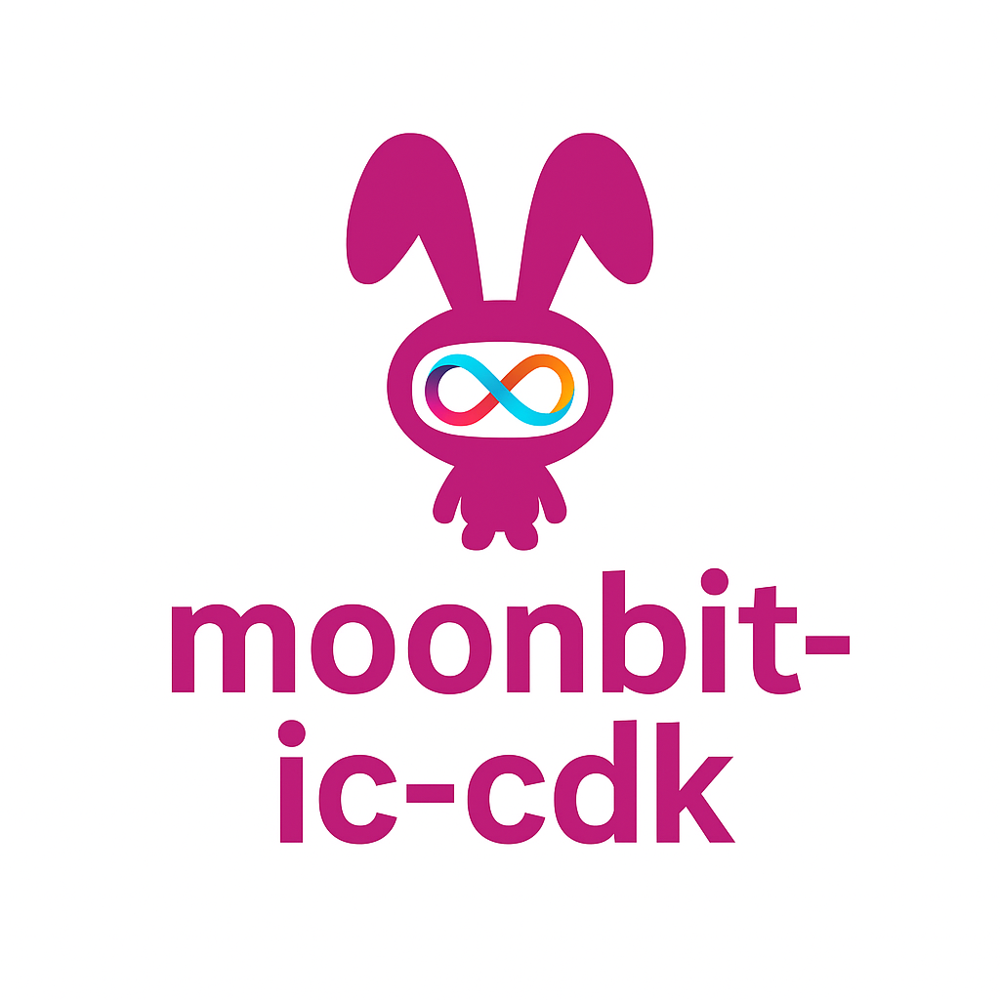

[](https://www.moonbitlang.com/)
<p>
  
</p>

> A MoonBit-powered developer toolkit for building fast, compact, and efficient smart contracts on the Internet Computer.

# 🌙 moonbit-ic-cdk

A lightweight, WebAssembly-native Canister Development Kit (CDK) for building smart contracts on the Internet Computer (ICP) with the MoonBit language.

---

## ✨ Why MoonBit?

[MoonBit](https://www.moonbitlang.com/) is a programming language and toolchain optimized for WebAssembly (WASM), designed for modern cloud and edge computing. It compiles into compact, high-performance WASM binaries with exceptional compile-time and runtime efficiency.

### 🚀 Why MoonBit for ICP Canister Development?

- Existing CDKs for ICP, aside from Rust, are often immature and less performant.
- MoonBit is built for WebAssembly from the ground up, offering a **developer-friendly** and **lightweight** alternative with **better compatibility** and **easier learning curve** than Rust.

---

## 🧱 Project Structure

This repository is a work-in-progress implementation of a MoonBit CDK for the Internet Computer. Current components include:

### 📦 [`ic-types`](ic-types)
> Core ICP types and utilities  
Implements ICP primitives like `Nat`, `Number`, `Principal`, `Result`, and `LEB128`.

### 🧬 [`ic-principal`](src/ic-principal)
> MoonBit version of `ic-principal`  
Implements the `Principal` type and related utility functions, used for representing identities (users, canisters) on the Internet Computer.

### 🧩 [`ic0`](src/ic0)
> Wasmtime FFI bindings to the IC system API  
Enables direct low-level WASM interaction with the Internet Computer.

### 🌉 [`ic0-api-warp`](src/ic0)
> Higher-level abstraction over `ic0`, inspired by Rust’s `ic-cdk::mod.rs`.

### 🧪 [`example`](src/main)
> Working canister example written in MoonBit  
Demonstrates end-to-end deployment and off-chain interaction.

---

## 📈 Project Status

- [x] Phase 1: Support for core ICP types and system API
    - [x] Support for `ic0` and `ic0-warp` APIs
    - [x] MoonBit canister example successfully deployed on the Internet Computer
- [ ] Phase 2: Extend CDK features for management canister api, inter-canister calls, json se/de serialization, etc.

✅ **We are collaborating with the MoonBit core development team to jointly promote ICP adoption in the MoonBit ecosystem.**

---

## 🚧 Work in Progress

Currently under active development:

- **candid-moonbit**: Building a Candid serialization/deserialization system in MoonBit.
- **leb128-moonbit**: Implementing LEB128 encoding and decoding support for integer types.

---

## 🛣️ Roadmap

### ⏳ Next 1–3 Months (High Priority)

The top development focus is completing **candid-moonbit**, an essential part of the `ic-moonbit-cdk` ecosystem:

- [ ] **LEB128 encode/decode**  
  Develop `leb128-moonbit` to handle Candid-compliant integer serialization.

- [ ] **Basic Candid types mapping and se/de implementation**  
  Map Candid primitive types to MoonBit types and implement corresponding serialization/deserialization.

- [ ] **Serialization/deserialization for core types**  
  Implement se/de for types like `number`, `principal`, and `result`.

- [ ] **Candid IDL Builder**  
  Build type serializer and value serializer generators for Candid interface description.

- [ ] **Encapsulation of `http_request`, `http_response`, and storage APIs**  
  Simplify building web service canisters with high-level HTTP and storage interfaces.

---

### 🔮 Future Feature Plans (Post V2)

- [ ] **Further enhancements to `ic-types-moonbit`**

- [ ] **Async support for canister-to-canister calls**  
  Implement asynchronous messaging if MoonBit introduces async/await primitives.

- [ ] **Management Canister API support**  
  Enable operations like canister creation, upgrade, deletion, and controller management, etc.

- [ ] **Fully-featured CDK API**  
  Develop high-level abstractions for stable memory, certified data, traps, and cycles, etc.

- [ ] **JSON serialization as default**

---

## ⚙️ Usage

Follow these steps to install the MoonBit compiler, clone the CDK repo, build the example canister, and deploy it on ICP:

```shell
# install moonbit
# linux & macOS
curl -fsSL https://cli.moonbitlang.com/install/unix.sh | bash
# windows
Set-ExecutionPolicy RemoteSigned -Scope CurrentUser; irm https://cli.moonbitlang.com/install/powershell.ps1 | iex

# clone the repo
git clone https://github.com/eliezhao/moonbit-ic-cdk.git

# navigate to the example
cd moonbit-ic-cdk/src/main

# build with moonbit
moon build --target wasm --release

# deploy with dfx
dfx canister --ic install ${your_canister_principal} --wasm target/wasm/release/build/main/main.wasm
```

---

## 🌟 Community & Recognition

- 📚 `ic-moonbit-cdk` has been officially included in the [awesome-internet-computer](https://github.com/dfinity/awesome-internet-computer) curated list by DFINITY.
- 💬 Join the discussion on the [DFINITY Developer Forum](https://forum.dfinity.org/t/moonbit-ic-cdk-a-moonbit-powered-canister-development-kit-for-icp/43684/9) and share your feedback or ideas!

We welcome contributions, suggestions, and collaboration from the Internet Computer community!